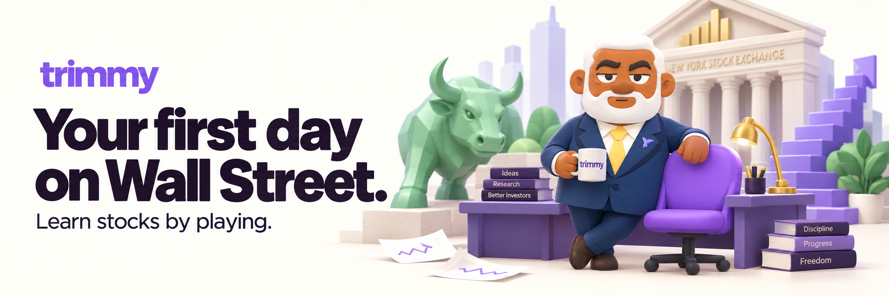
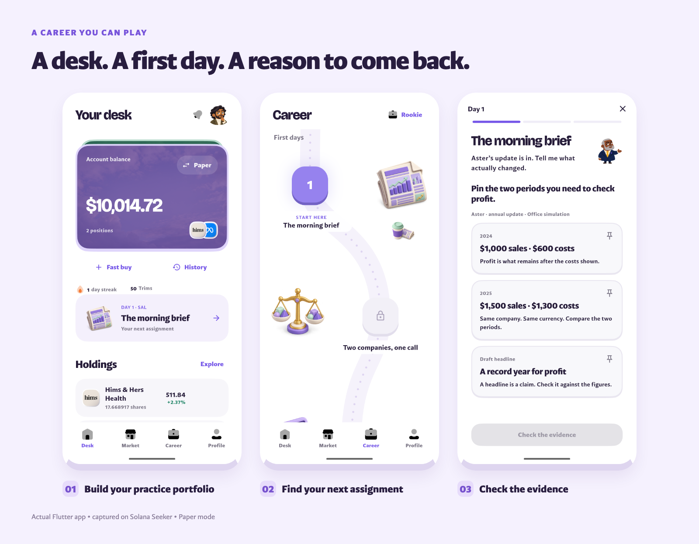
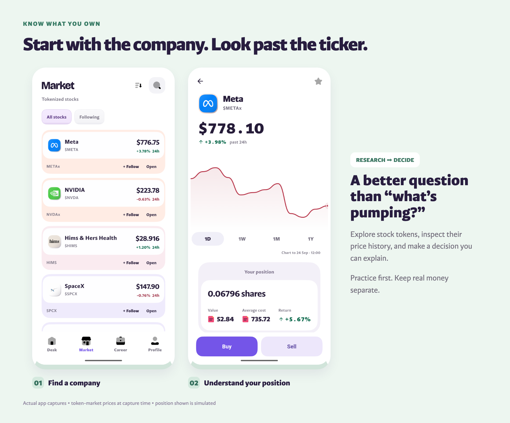
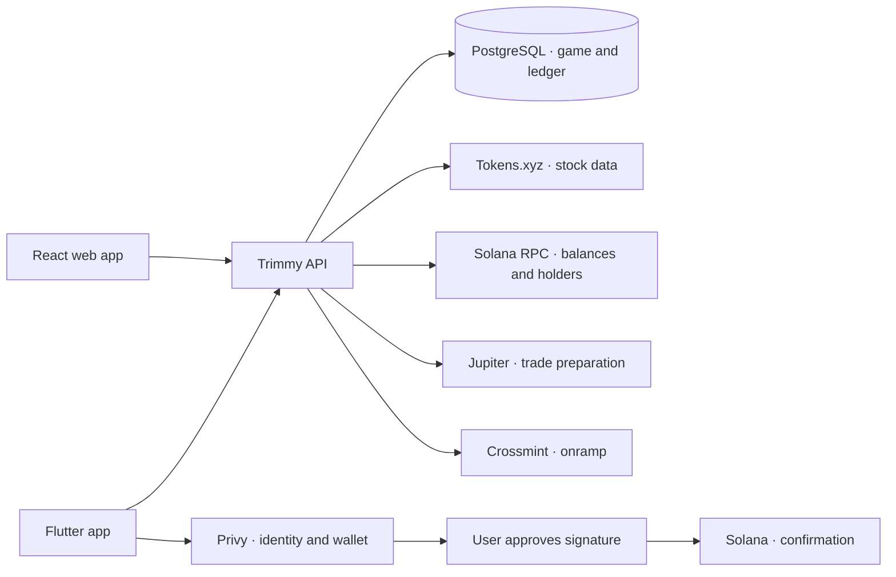

<p align="center">
  
</p>

<h1 align="center">Learn stocks by playing.</h1>

<p align="center">
  Trimmy is a Wall Street simulation game. Buy your first practice stock, explain your decisions, and work your way from Rookie to Analyst.
</p>

<p align="center">
  <a href="https://trimmy-submission.vercel.app/"><strong>Watch the demo</strong></a>
  &nbsp;·&nbsp;
  <a href="https://trimmy-submission.vercel.app/try"><strong>Try Trimmy</strong></a>
  &nbsp;·&nbsp;
  <a href="https://trimmy-submission.vercel.app/pitch"><strong>Pitch &amp; deck</strong></a>
  &nbsp;·&nbsp;
  <a href="docs/DEVELOPMENT.md"><strong>Run it locally</strong></a>
</p>

## Your first day

Buying a stock is getting easier. Knowing **what to buy, and why**, is still the hard part.

Trimmy gives you a desk before it asks you to become an investor. Pick a company, choose an amount, review your first paper order, and celebrate your first position. Then create your trader profile or explicitly continue as a guest.

Your Desk brings together what you own, your next assignment, and a quick way to trade. Paper and Real are separate modes: purple for practice, green for your wallet.

<p align="center">
  
</p>

## Clock in. Make the call.

You are the new intern. Sal has an update on his desk. Sales are up—but did the company actually make more profit?

Read the figures. Pin the evidence. Make a decision. File your answer and find out what you missed. These are short, playable workdays with characters, sound, and feedback. The first **20 assignments** each have three stages: **inspect → decide → hand off**.

Completed work earns **Trims**, the game's progression points. Your rank, streak, and next assignment give you a reason to return. New workdays can be published through the API using the existing activity types, without shipping a new app.

[See how workdays are authored →](content/workdays/README.md)

## Look past the ticker

Find a company, explore its tokenized stock, inspect the price history, and see your position. Market research connects the game to the decisions people make outside it. Written trade reasons make the *why* part of the experience.

<p align="center">
  
</p>

## A path from practice to ownership

When a player chooses Real mode, the Desk changes to the wallet's cash balance. Fast buy and asset orders follow that choice throughout the app. Add money brings together an onchain deposit address and card checkout, with automatic balance and order-status checks.

The Solana execution path uses Privy for the user's wallet and Jupiter for a reviewed stock-token trade. The server validates the transaction before the user signs, then checks its result onchain.

**Current build:** the game, paper trading, market research, and wallet reads are implemented. Live Solana trading is enabled for the supported AAPLx ↔ USDC route. The demo records a $2 AAPLx buy, confirmation, and updated holdings; this verifies the recorded buy, not every asset or trade direction. Crossmint card checkout remains in staging and does not fund a mainnet purchase. Funded crypto purchases use the Solana wallet. Real wallet balances and stock holdings remain separate from the practice ledger.

## Under the hood



| Part | Responsibility |
| --- | --- |
| **Flutter** | Native app, animated world, onboarding, Desk, Market, Career and Profile |
| **Fastify + TypeScript** | Authenticated APIs, quotes, order checks and progression |
| **PostgreSQL** | Paper ledger, saved decisions, workdays, rewards and account state |
| **Privy** | Sign-in and embedded wallet; server code does not receive the wallet's private key |
| **Tokens.xyz + Solana RPC** | Stock discovery, charts, wallet balances and public token accounts |
| **Jupiter + Crossmint** | Supported Solana execution and staging card funding |

Solana is the implemented chain for this submission. Sui, Base and BNB are expansion plans, not shipped trading integrations.

## Run it locally

Use **Node 24**, **npm 10.9.8**, and **Flutter 3.44.2**.

```bash
npm ci
node tool/prepare-public-assets.mjs
npm run dev:api
```

In another terminal:

```bash
cd apps/mobile
flutter pub get --enforce-lockfile
cp account-config.example.json account-config.local.json
# Set your public app identifiers and API URL in account-config.local.json.
flutter run --flavor production --dart-define-from-file=account-config.local.json
```

The unconfigured API starts on port **4100** with provider-backed features disabled. Persistent gameplay needs PostgreSQL and the configuration described in the [development guide](docs/DEVELOPMENT.md). Commercial font files, restricted library sounds and private credentials are intentionally excluded; the setup command prepares public build substitutes.

[Development](docs/DEVELOPMENT.md) · [Architecture](docs/ARCHITECTURE.md) · [Security](SECURITY.md) · [Asset credits](docs/ASSETS.md)

---

Built for Stocklana. A first stock is a beginning. Learning why is the game.
