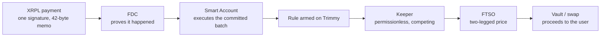

# Trimmy — conditional execution for XRP

**One XRPL payment arms a rule. The rule then executes itself.** No EVM wallet, no gas token, no
browser extension, and nobody has to be online when the condition is met.

Live on Coston2. Both halves below have run end to end on chain — every claim on this page has a
transaction behind it in [`docs/GROUND-TRUTH.md`](docs/GROUND-TRUTH.md).

| | address |
| --- | --- |
| `Trimmy` | [`0x19F81AAB43f7a26B0659754b70179aDcAF43ef7C`](https://coston2-explorer.flare.network/address/0x19F81AAB43f7a26B0659754b70179aDcAF43ef7C) |
| `TrimmyConfidentialTrigger` | [`0x02EA709e2278EACDbA00D4A88caA604E3b35293b`](https://coston2-explorer.flare.network/address/0x02EA709e2278EACDbA00D4A88caA604E3b35293b) |
| FCC extension | `66052` |
| TEE machine | `0xB33E5CF59e3ce1D58427B9F4E23d0444c128D3D7` — `GCP_AMD_SEV`, real hardware |
| FXRP/WC2FLR pool | [`0xafcA1C5DfF08b3B8Bacb7721fb8189d2D8E7C3DB`](https://coston2-explorer.flare.network/address/0xafcA1C5DfF08b3B8Bacb7721fb8189d2D8E7C3DB) — **ours**, see below |

---

## The problem

An XRP holder who wants "sell into the vault every hour" or "get me out if it drops" has two
options today. Watch the chart themselves, or hand their keys to someone who will. The second is how
most people lose money in this market, and the first does not work while you are asleep.

Everything needed to fix that already exists on Flare — FTSO for prices, FDC for proving an XRPL
payment happened, FAssets for the XRP itself, Smart Accounts so an XRPL payment can drive an EVM
call. What did not exist is the thing that ties them together and needs nothing from the user
afterwards.

## What actually happens



The user signs once, in a wallet they already have, and is done. The rule is then executed by
whoever gets there first, because executing pays a fee that the rule itself carries.

### The four triggers

| trigger | fires when | who can execute |
| --- | --- | --- |
| `PRICE_BELOW` | the relative price drops to the threshold | anyone |
| `PRICE_ABOVE` | it rises to the threshold | anyone |
| `SCHEDULE` | every N seconds | anyone |
| `PRIVATE` | **a secret threshold held inside a TEE** is met | anyone, given a signed verdict |

`PRIVATE` exists because a published stop price is a target. The other three store `triggerValue` in
the clear, so anybody reading `ruleAt(id)` knows exactly when a large, price-insensitive sell will
arrive. That is why centralised venues do not publish stop books.

## The confidential half

A `PRIVATE` rule puts a **commitment** on chain and the threshold nowhere. The number lives only
inside a GCP Confidential Space enclave on AMD SEV, and the chain will not fire the rule without a
fresh verdict signed by a machine the registry vouches for.

```text
on chain:   commitment = keccak256(threshold ‖ 0x1f ‖ salt ‖ 0x1f ‖ direction)
            triggerValue = 0
in enclave: the threshold itself, delivered ECIES-encrypted, decrypted only inside the TEE
```

Verified on the live deployment: the enclave decrypted the payload and **independently recomputed
the same commitment** the chain holds, then returned `{"fire":true}` carrying no threshold, no
margin and no bounds. The rule executed. The threshold appears nowhere on chain.

Two properties took real work and are worth naming, because both were bugs first:

- **The evaluation price comes from the chain, never the caller.** `requestEvaluation` used to take
  a caller-supplied price. That let any stranger ask "does this rule fire at a price of 1?", collect
  the genuine signed verdict from the proxy's public endpoint, and fire someone else's rule — and,
  by probing, binary-search the secret in about twenty queries.
- **A verdict must answer a question this contract asked.** Otherwise a verdict minted by any other
  instruction satisfies `acceptVerdict` and every other check is decoration.

Both are pinned by [`test/VerdictBinding.t.sol`](contracts/test/VerdictBinding.t.sol) and re-verified
against the live contract — see [`docs/GROUND-TRUTH.md` §000](docs/GROUND-TRUTH.md).

**The trust model here is strictly weaker than the other three triggers, and the code says so.** A
`PRIVATE` rule needs one enclave to be running, so its operator can censor it by declining to act.
`PRICE_BELOW`, `PRICE_ABOVE` and `SCHEDULE` are permissionless and re-derive every bound on chain.
The two are never described as equally trustless.

## Design rules this code actually follows

- **No owner, no admin, no proxy, no pause, no rescue.** The token and venue allowlists are written
  once in the constructor and no code path can change them. A mutable venue registry is a rug
  vector, and the security argument rests on the reachable external calls being fixed at deploy time.
- **One oracle read is not a price.** Every quote is two-legged — sell feed against buy feed — so a
  threshold keeps its meaning whatever the counter-token is worth. A single-leg comparison silently
  assumes a $1 peg.
- **Refuse rather than guess.** A stale feed, a future-dated feed, a missing enclave secret and an
  unpriceable pair all revert. None of them fall back to "probably fine".
- **Resolve, never hardcode.** `ContractRegistry` is the only literal address in the system.

## Repository

| path | what it is |
| --- | --- |
| [`contracts/`](contracts/) | `Trimmy.sol`, `Quote.sol`, `TrimmyConfidentialTrigger.sol` — Foundry, 92 tests |
| [`fcc/extension/`](fcc/extension/) | the enclave handler (Go) and the tooling that attests and registers it |
| [`keeper/`](keeper/) | permissionless executor, Dart, on our own [`../sdk`](../sdk) |
| [`arming/`](arming/) | builds the XRPL arming payment, and an **independent decoder** that refuses tampered ones |
| [`web/`](web/) | the arming page — static, no dependencies, shows you what you are signing before you sign it |
| [`docs/GROUND-TRUTH.md`](docs/GROUND-TRUTH.md) | every measured fact, with the command that produced it |
| [`research/`](research/) | architecture, and the adversarial reviews that changed it |

Built on two of our own libraries: [`../sdk`](../sdk), a pure-Dart Flare SDK that never signs, and
[`../plimsoll`](../plimsoll), which decodes XRPL→Flare payments so a user can see what they are
authorising. Trimmy's arming payload is built on Plimsoll's **measured** memo layout, not the
documented one — the TypeScript example in circulation lists ten fields where the wire format is the
nine-field EIP-4337 v0.7 struct, and a wrong layout does not fail loudly, it produces a commitment
that never matches.

## Running it

```bash
cd contracts && forge test --no-match-path "test/research/*"   # 92 tests
cd keeper    && TRIMMY_ADDRESS=0x19F8... dart run bin/keeper.dart --once
cd arming    && dart run bin/decode.dart --memo-file <memo> --file <preimage>
```

The keeper simulates every candidate with `eth_call` before signing, so a rule that would revert
costs an RPC round trip rather than gas. The decoder needs no network and exits non-zero on a memo
that does not match its pre-image.

## Honest status

Coston2 testnet. What is not done, stated plainly rather than omitted:

- Coston2 had **no FXRP pool at all** — measured, all 80 combinations of 5 factories × 4
  counter-tokens × 4 fee tiers returned `address(0)`. So we deployed and seeded
  [`0xafcA1C5D…`](https://coston2-explorer.flare.network/address/0xafcA1C5DfF08b3B8Bacb7721fb8189d2D8E7C3DB)
  ourselves. **It is ours and it is thin** — 0.31 FXRP and 50 WC2FLR, concentrated ±5%. A 0.01 FXRP
  sell executes at 38 bips of cost; a 0.05 FXRP sell is refused. Both are recorded in
  [§3a](docs/GROUND-TRUTH.md).
- **One-tap signing is not built.** [`web/`](web/) builds and explains the payment entirely in the
  browser, but Xaman's hex deep link carries TrustSet transactions only, so a memo-bearing sign
  request needs their Platform API and a server-held key. The page gives you the three fields to
  enter in any XRPL wallet instead of faking a deep link that does not exist.
- `PRIVATE` runs on a single enclave, so it is censorable by one operator. Multi-machine verdicts
  are a design change, not a configuration change.
